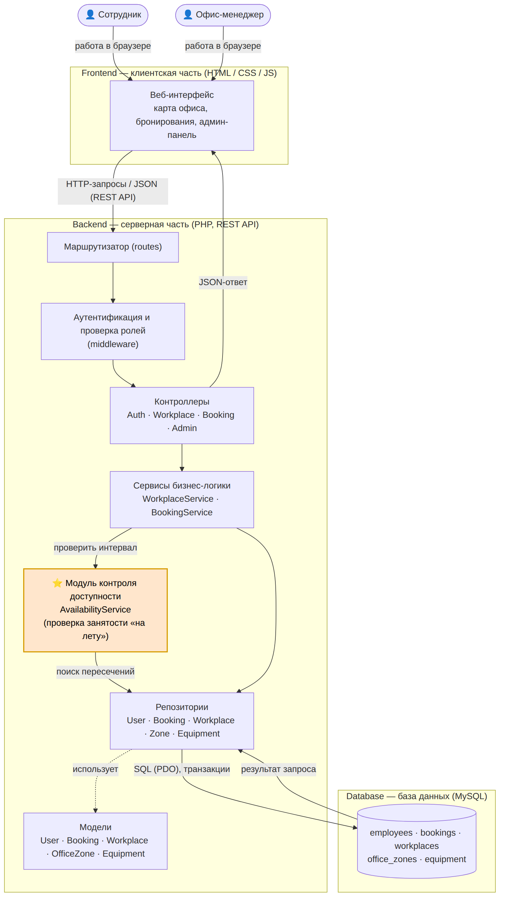
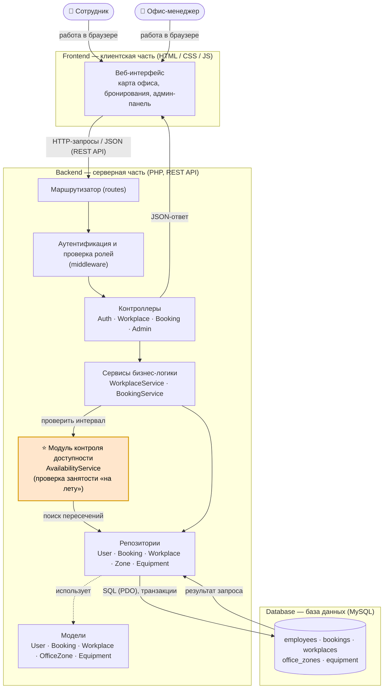
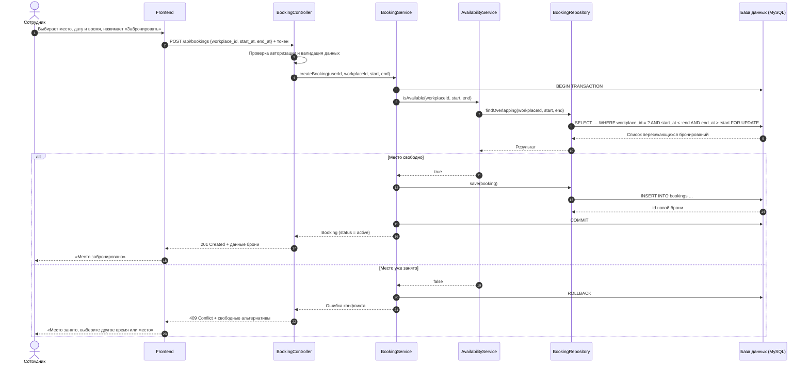

# Лабораторная работа №3
## Проектирование архитектуры информационной системы

**Тема:** Архитектура веб-систем: клиент, сервер и API
**Предметная область:** система бронирования рабочих мест в офисе

## Цель работы

Изучить принципы проектирования архитектуры информационных систем, определить структуру приложения, спроектировать взаимодействие между основными компонентами и подготовить структуру программного проекта для дальнейшей разработки.

## Краткое описание задания

На основе предметной области из лабораторных работ №1–2 (сущности *Сотрудник*, *Бронирование*, *Рабочее место*, *Офисная зона*, *Оборудование*) разработана архитектура веб-системы бронирования рабочих мест. Выбран архитектурный стиль, выделены компоненты, описано их взаимодействие, определена нетиповая особенность предметной области, подготовлены структура проекта, диаграмма архитектуры и диаграмма взаимодействия.

---

## 1. Выбор архитектуры приложения

**Тип приложения:** веб-приложение, работающее в браузере. Сотрудники бронируют места с рабочего компьютера или телефона без установки программ.

**Архитектурный стиль:** трёхуровневая архитектура (3-tier) с REST API между клиентом и сервером.

| Уровень | Технологии | Назначение |
|---|---|---|
| **Frontend** (клиентская часть) | HTML, CSS, JavaScript | Интерфейс: карта офиса, выбор места и времени, список своих бронирований, панель офис-менеджера. Отправляет HTTP-запросы к API и показывает ответы. |
| **Backend** (серверная часть) | PHP, REST API (JSON) | Приём запросов, аутентификация и проверка ролей, бизнес-логика бронирования, проверка занятости мест, работа с данными. |
| **Database** (база данных) | MySQL | Постоянное хранение сотрудников, зон, рабочих мест, оборудования и бронирований. |

**Преимущества выбранного подхода:**

- уровни разрабатываются и тестируются независимо: интерфейс можно переделать, не трогая сервер;
- бизнес-правила (например, запрет двойного бронирования) находятся в одном месте — на сервере, их нельзя обойти с клиента;
- REST API позволит позже добавить мобильное приложение или интеграцию с корпоративным календарём без изменения backend;
- простая и распространённая схема, для PHP + MySQL легко найти хостинг.

## 2. Компоненты системы

| № | Компонент | Уровень | Назначение и ответственность |
|---|---|---|---|
| 1 | Веб-интерфейс | Frontend | Страницы входа, карта офиса по зонам, форма бронирования, «Мои бронирования», админ-панель офис-менеджера. |
| 2 | Маршрутизатор (routes) | Backend | Сопоставляет HTTP-метод и URL с нужным контроллером. |
| 3 | Модуль аутентификации (middleware) | Backend | Проверяет токен, определяет пользователя и роль (сотрудник / офис-менеджер), закрывает доступ к чужим данным и админ-функциям. |
| 4 | Контроллеры | Backend | `AuthController`, `WorkplaceController`, `BookingController`, `AdminController` — принимают запрос, проверяют входные данные, вызывают сервис и формируют JSON-ответ с кодом статуса. |
| 5 | Сервисы | Backend | `BookingService` — создание и отмена брони, правила (нельзя бронировать в прошлом, не больше одной брони на сотрудника в интервал); `WorkplaceService` — список мест, фильтрация по зоне и оборудованию. |
| 6 | **Модуль контроля доступности** ⭐ | Backend | `AvailabilityService` — проверка занятости места на выбранный интервал «на лету» и защита от двойного бронирования (см. раздел 4). |
| 7 | Репозитории | Backend | `UserRepository`, `BookingRepository`, `WorkplaceRepository`, `ZoneRepository`, `EquipmentRepository` — все SQL-запросы к БД через PDO. |
| 8 | Модели | Backend | `User`, `Booking`, `Workplace`, `OfficeZone`, `Equipment` — структуры данных предметной области. |
| 9 | База данных | Database | Таблицы `employees`, `office_zones`, `workplaces`, `equipment`, `bookings`. |

Внешние сервисы на этом этапе не используются.

## 3. Взаимодействие компонентов

**Направление передачи данных:**
Пользователь → Frontend → (HTTP/JSON) → Маршрутизатор → Аутентификация → Контроллер → Сервис → Репозиторий → (SQL) → БД, и обратно в виде JSON-ответа.

**Последовательность обработки запроса** (на примере «Забронировать место»):

1. Сотрудник выбирает на карте место, дату и время и нажимает «Забронировать».
2. Frontend отправляет `POST /api/bookings` с `workplace_id`, `start_at`, `end_at` и токеном.
3. Маршрутизатор передаёт запрос в `BookingController`, предварительно middleware проверяет токен.
4. Контроллер проверяет корректность данных (дата не в прошлом, начало раньше конца) и вызывает `BookingService`.
5. `BookingService` открывает транзакцию и обращается к `AvailabilityService`.
6. `AvailabilityService` через `BookingRepository` ищет в БД брони этого места, пересекающиеся по времени.
7. Если пересечений нет — бронь сохраняется (`INSERT`), транзакция фиксируется, клиент получает `201 Created`.
8. Если место занято — транзакция откатывается, клиент получает `409 Conflict` и список свободных альтернатив.
9. Frontend показывает пользователю результат.

**Взаимодействие с базой данных:** только через репозитории, запросы параметризованные (PDO), изменения бронирований выполняются в транзакциях.

**Взаимодействие с внешними сервисами:** не предусмотрено; в дальнейшем возможна интеграция с корпоративной почтой для напоминаний.

## 4. Индивидуальная особенность предметной области

**Особенность:** проверка занятости рабочего места на конкретную дату и время «на лету» и защита от двойного бронирования.

**В чём заключается.** Это не простое сохранение формы: перед созданием брони система должна найти все активные бронирования этого места, которые **пересекаются по времени** с запрошенным интервалом (условие `start_at < новый_конец AND end_at > новое_начало`). Если два сотрудника одновременно нажмут «Забронировать» на одно и то же место, обычная проверка «SELECT, потом INSERT» пропустит обоих. Поэтому проверка и сохранение выполняются в одной транзакции с блокировкой строк (`SELECT … FOR UPDATE`).

**Почему это важно для предметной области.** Главная ценность системы — сотрудник, пришедший в офис, гарантированно получает своё место. Двойная бронь означает конфликт в офисе и потерю доверия к системе. Кроме того, при отказе полезно сразу предложить свободные места в той же зоне с тем же оборудованием.

**Ответственный компонент:** новый компонент **«Модуль контроля доступности» (`AvailabilityService`)** на уровне backend. Его вызывает `BookingService`, сам он получает данные через `BookingRepository`. Для быстрого поиска пересечений в таблице `bookings` создан индекс `(workplace_id, start_at, end_at)`.

Компонент выделен цветом на диаграмме архитектуры (раздел 6) и показан в сценарии на диаграмме взаимодействия (раздел 7) — ветки «Место свободно» / «Место уже занято».

## 5. Структура проекта

```
lab3/
├── README.md                    # отчёт (этот файл)
├── diagrams/
│   ├── architecture.mmd         # исходник диаграммы архитектуры (Mermaid)
│   └── sequence-booking.mmd     # исходник диаграммы взаимодействия (Mermaid)
├── images/
│   ├── architecture.png
│   └── sequence-booking.png
└── src/                         # каркас будущего приложения
    ├── frontend/
    │   ├── index.html
    │   ├── css/style.css
    │   ├── js/api.js            # обёртка запросов к REST API
    │   ├── js/app.js
    │   └── pages/
    ├── backend/
    │   ├── index.php            # точка входа
    │   ├── config/database.php  # подключение к MySQL (PDO)
    │   ├── routes/api.php       # таблица маршрутов
    │   ├── middleware/AuthMiddleware.php
    │   ├── controllers/         # Auth, Workplace, Booking, Admin
    │   ├── services/            # BookingService, WorkplaceService, AvailabilityService
    │   ├── repositories/        # User, Booking, Workplace, Zone, Equipment
    │   └── models/              # User, Booking, Workplace, OfficeZone, Equipment
    ├── database/
    │   └── schema.sql           # схема БД
    └── docs/
        └── api.md               # описание REST API
```

Backend разбит на каталоги по типам компонентов (controllers → services → repositories → models), что соответствует слоям трёхуровневой архитектуры и принципу единственной ответственности.

## 6. Диаграмма архитектуры



Исходник: [`diagrams/architecture.mmd`](diagrams/architecture.mmd)



На диаграмме показаны два актёра (Сотрудник, Офис-менеджер), три уровня системы и компоненты backend. Запросы идут сверху вниз: интерфейс → маршрутизатор → проверка прав → контроллеры → сервисы → репозитории → БД. Оранжевым выделен модуль контроля доступности — компонент нетиповой особенности.

## 7. Диаграмма взаимодействия компонентов (Sequence Diagram)

Сценарий: **«Сотрудник бронирует рабочее место»**.


Исходник: [`diagrams/sequence-booking.mmd`](diagrams/sequence-booking.mmd)



Сплошные стрелки — запросы, пунктирные — ответы. Блок `alt` показывает две ветки работы модуля контроля доступности: место свободно (бронь сохраняется, `201`) и место занято (откат транзакции, `409` с альтернативами).

## 8. Описание API

Основные эндпоинты:

| Метод | Путь | Назначение |
|---|---|---|
| POST | `/api/auth/login` | Вход |
| GET | `/api/workplaces` | Список мест с фильтрами |
| GET | `/api/workplaces/{id}/availability` | Занятость места на дату |
| GET | `/api/bookings/my` | Мои бронирования |
| POST | `/api/bookings` | Создать бронь |
| DELETE | `/api/bookings/{id}` | Отменить бронь |
| POST/PUT | `/api/admin/workplaces` | Управление местами (офис-менеджер) |

Полное описание с примерами запросов и ответов: [`src/docs/api.md`](src/docs/api.md).

## Вывод

В ходе работы для системы бронирования рабочих мест в офисе выбрана трёхуровневая архитектура веб-приложения (Frontend на HTML/CSS/JS, Backend на PHP с REST API, база данных MySQL). Выделены компоненты серверной части по слоям (контроллеры, сервисы, репозитории, модели) и описано их взаимодействие при обработке запроса. В качестве нетиповой особенности определена проверка занятости места «на лету» с защитой от двойного бронирования; за неё отвечает отдельный компонент `AvailabilityService`, отражённый на обеих диаграммах. Подготовлены структура проекта, схема БД и описание API — это основа для реализации системы в следующих лабораторных работах.
